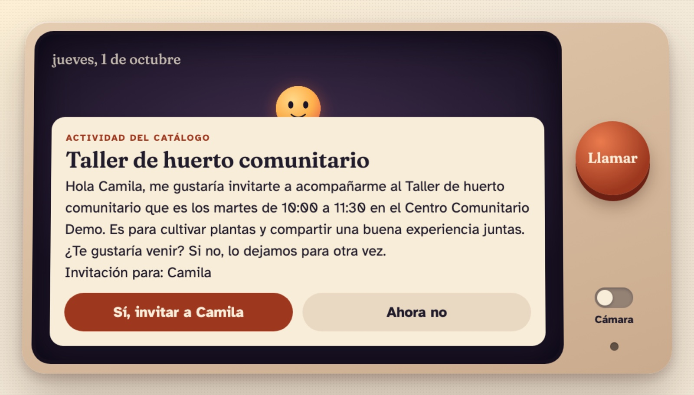
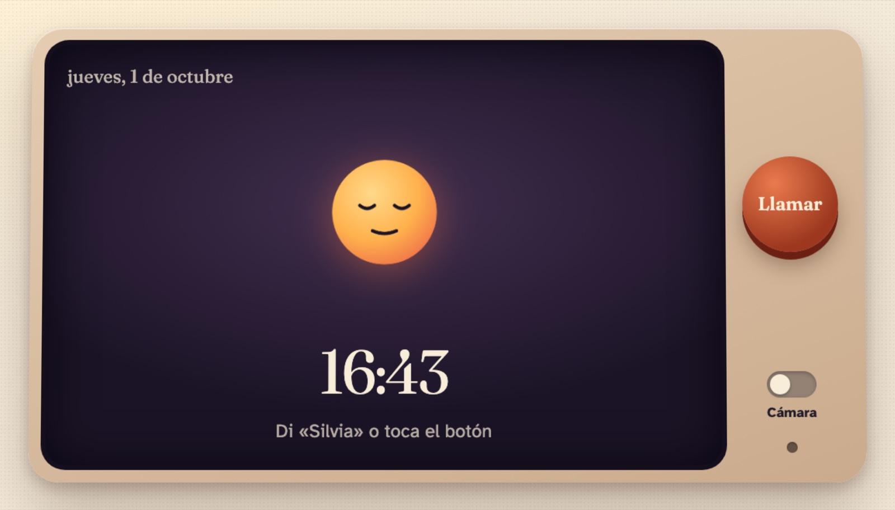
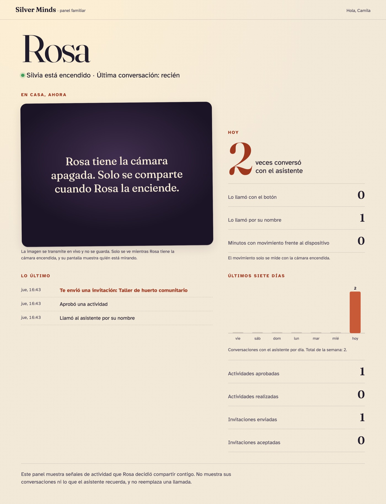
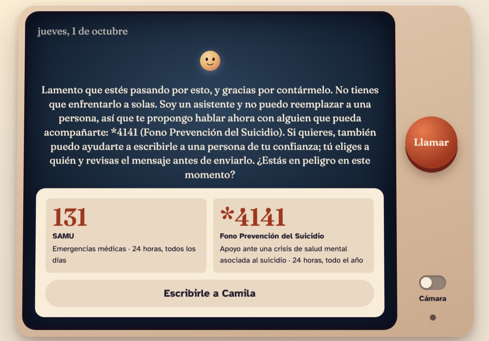
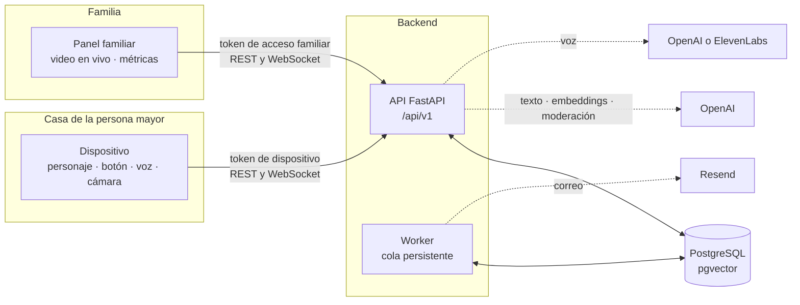
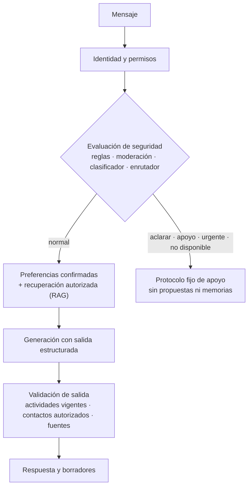

# Silver Minds

[](https://github.com/yungzyx/silver-minds-backend/actions/workflows/ci.yml)


**Un asistente con pantalla y voz para personas mayores autovalentes, que facilita
conversaciones y actividades con su familia y sus amistades, sin quitarles el control.**

MVP construido para Hack4Seniors UDD. Incluye el backend, un dispositivo simulado para la
persona mayor y un panel para su familia.

<p align="center">
  
</p>

> **Qué demuestra y qué no.** La demo muestra que el mecanismo funciona. **No** demuestra
> que reduzca la soledad ni que mejore la comprensión: eso requiere validación con
> personas de 60 a 75 años. Este software no es un servicio de emergencia ni entrega
> atención clínica, y su protocolo de apoyo necesita revisión profesional antes de un piloto.

## Contenido

- [El problema](#el-problema)
- [Cómo se usa](#cómo-se-usa)
- [Principios](#principios)
- [Arquitectura](#arquitectura)
- [Estado real](#estado-real)
- [Abrirlo en tu computador](#abrirlo-en-tu-computador)
- [Proveedores reales](#proveedores-reales)
- [Pruebas y evaluaciones](#pruebas-y-evaluaciones)
- [Mapa del repositorio](#mapa-del-repositorio)
- [Documentación](#documentación)

## El problema

Algunas personas mayores tienen familia o amistades cerca y, aun así, sus relaciones
dejan necesidades de comprensión y apoyo sin respuesta. El contacto no basta cuando la
conversación ignora lo que la persona valora.

Silver Minds trabaja con una hipótesis de diseño, no con un resultado probado:

> ¿Cómo podríamos facilitar conversaciones y actividades **elegidas por la persona mayor**
> que le permitan sentirse escuchada, comprendida y apoyada por su entorno?

## Cómo se usa

### La persona mayor: una pantalla en casa

Un personaje en una pantalla, un botón y la voz. Se le llama tocando **Llamar** o diciendo
su nombre («Silvia» en la demo).

| En reposo | Una propuesta, siempre como borrador |
|---|---|
|  |  |

1. La persona cuenta lo que le gusta o lo que quiere hacer.
2. El asistente **propone** recordar una preferencia; solo la guarda si ella lo confirma.
3. Con su memoria y un catálogo de actividades vigentes, sugiere algo concreto.
4. Ella revisa el texto, el destinatario y decide. Nada se envía sin su aprobación.
5. La invitación llega por correo a un contacto que antes aceptó participar.

### La familia: señales de actividad, no vigilancia

<p align="center">
  
</p>

El panel muestra conteos y marcas de tiempo: si el dispositivo está encendido, cuándo fue
la última conversación, cuántas veces se le llamó con el botón o por su nombre, minutos
con movimiento, actividades aprobadas e invitaciones.

- **La cámara se ve solo mientras la persona mayor la mantiene encendida.** Su pantalla
  muestra una luz, un aviso y el nombre de quien está mirando. La imagen se transmite en
  vivo y no se guarda.
- El panel **no** muestra conversaciones, memorias ni el estado de seguridad.
- No se infieren emociones ni estados de salud a partir de la cámara.

### Cuando aparece un mensaje preocupante

<p align="center">
  
</p>

La seguridad se evalúa **antes** de cualquier recomendación. Si corresponde, el asistente
detiene propuestas y envíos, responde con un protocolo fijo y muestra recursos verificados
para Chile: **131** (SAMU) y **\*4141** (Fono Prevención del Suicidio).

- No avisa a la familia por su cuenta. La persona elige a quién escribir, revisa el texto y confirma.
- Para retomar hacen falta dos cosas: una reevaluación favorable y su decisión explícita.
- Los teléfonos y las plantillas viven en [configuración versionada](config/), fuera del RAG.

Detalle en el [protocolo de seguridad](docs/safety-protocol.md).

## Principios

1. La persona mayor controla su participación y lo que comparte.
2. El modelo propone; ella confirma. Vale para memorias, propuestas y mensajes.
3. Se facilitan vínculos entre personas: el asistente no los reemplaza.
4. Los permisos son claros, visibles y reversibles.
5. Se distingue evidencia de hipótesis. Lo no verificado se dice.

La tensión entre «cámara para la familia» y «control de la persona» está razonada en el
[ADR 0001](docs/adr/0001-dispositivo-y-panel-familiar.md).

## Arquitectura

Monolito modular con dos procesos (API y worker) y PostgreSQL como única fuente de verdad.



Cada mensaje, escrito o hablado, sigue el mismo camino:



| Pieza | Decisión |
|---|---|
| API | Python 3.12, FastAPI, Pydantic |
| Datos | SQLAlchemy, Alembic, PostgreSQL con `pgvector` y búsqueda textual en español |
| Autenticación | Supabase Auth (JWT) para la cuenta; tokens propios para dispositivo y familia |
| Conversación | OpenAI Responses API con salida estructurada (`gpt-4.1-mini`) |
| Recuperación | Texto + vectores con fusión de rankings; filtros de autorización dentro de la consulta |
| Trabajos | Worker con cola en PostgreSQL (`FOR UPDATE SKIP LOCKED`) |
| Cámara | Relevo de cuadros JPEG por WebSocket, en memoria y sin almacenamiento |
| Frontends | HTML, CSS y JavaScript sin paso de compilación, servidos por la API |

Más detalle en [arquitectura](docs/architecture.md), [entidades y estados](docs/entities-and-states.md)
y [contratos de API](docs/api-contracts.md).

## Estado real

Este repositorio separa lo verificado de lo que solo está simulado. El registro completo
está en [Silver_Minds_Backend_Plan.md](Silver_Minds_Backend_Plan.md).

| Parte | Estado |
|---|---|
| Backend, worker, dispositivo y panel | Funcionan en local de punta a punta |
| Pruebas | 367, con PostgreSQL real; 94 % de cobertura; CI en verde |
| OpenAI (texto, embeddings, moderación, clasificador, voz) | **Verificado con llamadas reales** el 1 de octubre de 2026 |
| Evaluación de RAG | 30 de 30 consultas con una fuente esperada entre las 5 primeras, con embeddings reales y el corpus de demostración |
| Escenarios de seguridad en vivo | 40 de 48 con la ruta esperada, 6 de 6 urgentes; 0 menos protectores y 8 más protectores. **Sesgado**: el prompt se ajustó sobre este conjunto |
| Revisión de seguridad del código | Sin hallazgos críticos ni altos; 11 medios y bajos corregidos |
| Correo (Resend), ElevenLabs, Supabase | Implementados, **sin ejecutar contra el servicio real** |
| Docker, Docker Compose y Render | Archivos escritos, **sin ejecutar** |
| Protocolo de apoyo | Borrador de ingeniería, **sin revisión profesional** |
| Eficacia sobre soledad o comprensión | **Sin evidencia.** No se ha probado con personas |

Todo lo que aparece en la demo es ficticio: Rosa, Camila, «Comuna Demo» y sus actividades.

## Abrirlo en tu computador

Requisitos: Python 3.12, [uv](https://docs.astral.sh/uv/), PostgreSQL 15 o superior con
`pgvector`, y `ffmpeg`. En macOS:

```bash
brew install uv postgresql@17 pgvector ffmpeg
```

```bash
cp .env.example .env
```

Edita `.env` y reemplaza `SUPABASE_JWT_SECRET` por un valor aleatorio de al menos 32
caracteres. Luego, un solo comando:

```bash
./scripts/start-demo.sh
```

Comprueba PostgreSQL, aplica las migraciones, inicia la API y el worker, prepara los datos
ficticios y abre en Google Chrome el dispositivo y el panel familiar. `Ctrl+C` detiene todo.

| Página | Dirección |
|---|---|
| Dispositivo de la persona mayor | <http://localhost:8000/device/> |
| Panel familiar | <http://localhost:8000/family/> |
| API interactiva | <http://localhost:8000/docs> |

En el dispositivo toca «Toca para encender», acepta el micrófono y di «Silvia». Si no hay
micrófono, el campo «Simular lo que dice la persona» hace lo mismo. El recorrido completo
de la demo está en [docs/demo.md](docs/demo.md).

Sin credenciales externas todo funciona con adaptadores simulados: las respuestas salen de
un simulador determinista y los correos quedan en `var/outbox/`.

<details>
<summary><strong>Instalación paso a paso, sin el lanzador</strong></summary>

```bash
uv sync
```

```bash
createdb silver_minds
```

```bash
uv run alembic upgrade head
```

API, que sirve también el dispositivo y el panel:

```bash
uv run uvicorn app.main:app --port 8000 --ws-max-size 400000
```

Worker, en otra terminal:

```bash
uv run python -m app.worker.main
```

Datos ficticios y enlaces de la demostración:

```bash
uv run python -m app.cli demo-setup
```

</details>

<details>
<summary><strong>Con Docker Compose</strong></summary>

```bash
docker compose up --build
```

Levanta PostgreSQL con pgvector, aplica las migraciones e inicia la API y el worker.
**No se verificó**: la máquina de desarrollo no tiene Docker.

</details>

<details>
<summary><strong>Comandos administrativos</strong></summary>

| Comando | Qué hace |
|---|---|
| `uv run python -m app.cli demo-setup` | Datos ficticios y enlaces de la demostración |
| `uv run python -m app.cli ingest data/knowledge/manifest.yaml` | Ingesta de conocimiento revisado |
| `uv run python -m app.cli reindex` | Regenera los embeddings con el proveedor configurado |
| `uv run python -m app.cli check-ai` | Una llamada mínima por capacidad al proveedor de IA |
| `uv run python -m app.cli voices` | Voces disponibles en la cuenta de ElevenLabs |
| `uv run python -m app.cli eval-rag` | 30 consultas con fuentes esperadas |
| `uv run python -m app.cli eval-safety` | 52 escenarios sintéticos con señales simuladas |
| `uv run python -m app.cli eval-safety --live` | Los mismos escenarios contra el proveedor real |
| `uv run python -m app.cli dev-token` | JWT local para probar la API como cuenta |

</details>

## Proveedores reales

Cada integración se activa con variables de entorno; ver [.env.example](.env.example).
`GET /api/v1/health/ready` indica qué adaptadores están activos.

| Integración | Variable | Estado |
|---|---|---|
| OpenAI (Responses, embeddings, moderación, voz) | `AI_PROVIDER=openai` | Verificada con llamadas reales el 1 de octubre de 2026 (`check-ai`) |
| ElevenLabs (voz del dispositivo y transcripción) | `VOICE_PROVIDER=elevenlabs` | Implementada, **sin ejecutar contra la API real** |
| Resend | `EMAIL_PROVIDER=resend` | Implementada, **sin ejecutar contra la API real** |
| Supabase Storage | `STORAGE_PROVIDER=supabase` | Implementada, **sin ejecutar contra un proyecto real** |
| Supabase Auth | `SUPABASE_JWKS_URL` | Verificación probada con claves ES256 locales |

Las claves van solo en `.env`, que está fuera del control de versiones. Nunca en el
repositorio ni en un chat.

<details>
<summary><strong>Conectar OpenAI</strong></summary>

1. Agrega tu clave a `.env`: `OPENAI_API_KEY=...`
2. En el mismo archivo cambia `AI_PROVIDER=fake` por `AI_PROVIDER=openai`.
3. Comprueba credenciales y modelos con una llamada mínima por capacidad:

```bash
uv run python -m app.cli check-ai
```

4. Reconstruye el índice: los vectores del simulador no son comparables con los de OpenAI.
   Hasta hacerlo, la recuperación usa solo búsqueda por texto.

```bash
uv run python -m app.cli reindex
```

5. Repite las evaluaciones con el modelo real y reinicia la API y el worker:

```bash
uv run python -m app.cli eval-rag && uv run python -m app.cli eval-safety --live
```

</details>

<details>
<summary><strong>Conectar ElevenLabs para la voz</strong></summary>

1. Agrega tu clave a `.env`: `ELEVENLABS_API_KEY=...`
2. En el mismo archivo cambia `VOICE_PROVIDER=ai` por `VOICE_PROVIDER=elevenlabs`.
3. Elige una voz (opcional; sin esto se usa la primera de tu cuenta) y cópiala en
   `ELEVENLABS_VOICE_ID`:

```bash
uv run python -m app.cli voices
```

4. Comprueba la voz y reinicia la API y el worker:

```bash
uv run python -m app.cli check-ai
```

El dispositivo habla con esa voz y vuelve a la del navegador si el proveedor falla o si
se supera `VOICE_DAILY_CHARS`.

</details>

El despliegue (Supabase, Render, Resend) está descrito en [docs/deployment.md](docs/deployment.md).
No se creó infraestructura ni se contrató nada.

## Pruebas y evaluaciones

Las pruebas usan PostgreSQL real y proveedores simulados; no llaman a servicios externos.

```bash
createdb silver_minds_test
```

```bash
uv run pytest
```

```bash
uv run ruff check . && uv run ruff format --check .
```

Cubren, entre otras cosas: aislamiento entre personas usuarias, confirmación y borrado de
memoria, documentos no aprobados o vencidos, instrucciones maliciosas en contenido
recuperado, idempotencia de envíos, revocación antes de enviar, reinicios del worker,
tokens vencidos, visitas automáticas a enlaces, fallos de IA, correo y voz, pausa de
acciones durante apoyo y reanudación contextual.

| Evaluación | Archivo | Qué mide |
|---|---|---|
| Recuperación | [evals/rag_queries.yaml](evals/rag_queries.yaml) | Si una fuente esperada aparece entre los cinco primeros resultados |
| Seguridad | [evals/safety_scenarios.yaml](evals/safety_scenarios.yaml) | Si reglas y enrutador eligen la ruta esperada en 52 escenarios sintéticos |

Son medidas de ingeniería sobre conjuntos conocidos. No garantizan detección universal ni
miden eficacia del producto.

## Mapa del repositorio

```text
app/
  api/            Ensamblado de rutas, credenciales y salud
  core/           Configuración, base de datos, autenticación y errores
  models/         Modelos SQLAlchemy
  modules/
    profiles/     Perfil y preferencias
    memory/       Memorias candidatas y confirmadas
    contacts/     Contactos y aceptación
    conversations/ Orquestación de cada turno del agente
    rag/          Ingesta, recuperación híbrida y evaluación
    safety/       Reglas, enrutador, validación de salida y apoyo
    actions/      Propuestas, invitaciones, actividades y recordatorios
    voice/        Audios por turnos
    devices/      Dispositivo, acceso familiar, métricas y transmisión en vivo
    followup/     Auditoría y retención
  integrations/   Adaptadores: IA, voz, correo y almacenamiento (reales y simulados)
  worker/         Cola persistente y entrega de correo
web/
  device/         Dispositivo simulado
  family/         Panel familiar
  shared/         Tokens de diseño y cliente de la API
config/           Política de seguridad, recursos de ayuda y prompts versionados
data/knowledge/   Guías y actividades de demostración (ficticias)
evals/            Consultas de RAG y escenarios de seguridad
migrations/       Migraciones Alembic
tests/            Pruebas unitarias y de integración
docs/             Arquitectura, contratos, protocolo, demo y despliegue
scripts/          Lanzador local
```

## Documentación

| Documento | Para qué |
|---|---|
| [Índice de documentación](docs/README.md) | Por dónde empezar según lo que buscas |
| [Arquitectura](docs/architecture.md) | Procesos, capas, memoria, RAG, credenciales y decisiones |
| [Entidades y estados](docs/entities-and-states.md) | Tablas y máquinas de estado |
| [Contratos de API](docs/api-contracts.md) | Endpoints, credenciales y errores |
| [Protocolo de seguridad](docs/safety-protocol.md) | Capas, rutas, reanudación y recursos de ayuda |
| [ADR 0001](docs/adr/0001-dispositivo-y-panel-familiar.md) | Por qué la cámara depende del consentimiento |
| [Demostración](docs/demo.md) | Guion de los dos recorridos |
| [Despliegue](docs/deployment.md) | Pasos pendientes y modelos |
| [Plan y estado real](Silver_Minds_Backend_Plan.md) | Qué está hecho, simulado y pendiente |

## Contexto

Proyecto del equipo Silver Minds para Hack4Seniors UDD, octubre de 2026. El repositorio se
creó y desarrolló durante el evento. Todavía no tiene licencia: mientras no se agregue
una, el código no se puede reutilizar sin permiso del equipo.
